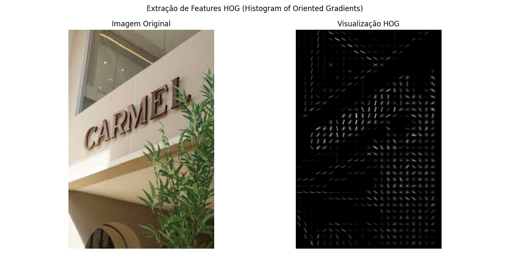

# Projeto: Extrator de Features HOG com Scikit-Image

Este repositório contém um script Python que demonstra a extração de features **HOG (Histogram of Oriented Gradients)** de uma imagem usando a biblioteca `scikit-image`.

## 1. A Técnica: HOG (Histogram of Oriented Gradients)

O HOG é um *descritor de features* amplamente utilizado em visão computacional para a detecção de objetos. A técnica funciona da seguinte maneira:

1.  **Calcula Gradientes:** A imagem é analisada para encontrar a magnitude (intensidade) e a orientação (direção) das mudanças de intensidade (bordas) em cada pixel.
2.  **Divide em Células:** A imagem é dividida em pequenas regiões chamadas "células" (ex: 8x8 pixels).
3.  **Cria Histogramas:** Para cada célula, é criado um histograma das orientações dos gradientes. Por exemplo, se uma célula tem muitas bordas verticais, o "bin" de 90 graus do histograma terá um valor alto.
4.  **Normaliza Blocos:** Para tornar o descritor robusto a variações de iluminação, as células são agrupadas em "blocos" maiores (ex: 2x2 células). O histograma de cada bloco é normalizado.
5.  **Vetor de Features:** Todos os histogramas normalizados dos blocos são concatenados para formar um único e longo vetor. Este vetor é a "assinatura" HOG da imagem, que pode ser usada para treinar modelos de Machine Learning (como um SVM) para reconhecer objetos.

Em suma, o HOG captura a **estrutura local da forma e da textura** de um objeto, ignorando a cor e variações de iluminação.

## 2. O que o Programa Faz

O script `extrair_features_hog.py` executa os seguintes passos:

1.  **Carrega** uma imagem de entrada chamada `imagem_entrada.jpg` (que deve estar no mesmo diretório).
2.  **Converte** a imagem para escala de cinza, que é o formato padrão para o cálculo do HOG.
3.  **Calcula** as features HOG usando a função `skimage.feature.hog`.
4.  **Gera** uma visualização que mostra a imagem original ao lado da representação visual das features HOG.
5.  **Salva** essa visualização como `resultado_hog.png`.
6.  **Imprime** no console as dimensões do vetor de features HOG extraído.

## 3. Como Executar

1.  **Clone este repositório:**
    ```bash
    git clone [URL-DO-SEU-REPOSITORIO]
    cd [NOME-DO-SEU-REPOSITORIO]
    ```

2.  **Crie um ambiente virtual e instale as dependências:**
    ```bash
    python -m venv venv
    source venv/bin/activate  # No Windows: venv\Scripts\activate
    pip install -r requirements.txt
    ```

3.  **Adicione sua imagem:**
    * Encontre uma imagem de sua preferência (ex: uma foto de um carro, pessoa ou animal) em sites como [Pexels](https://www.pexels.com) ou [Unsplash](https://www.unsplash.com).
    * **Importante:** Salve esta imagem na raiz do projeto com o nome `imagem_entrada.jpg`. O script *não* funcionará sem ela.

4.  **Execute o script:**
    ```bash
    python extrair_features_hog.py
    ```

## 4. Exemplo de Resultado

Após a execução, um arquivo `resultado_hog.png` será gerado, mostrando a imagem original e sua representação HOG. A imagem HOG destaca as bordas e texturas que o algoritmo "enxergou".

*(Você pode inserir aqui a imagem `resultado_hog.png` que o script irá gerar)*

